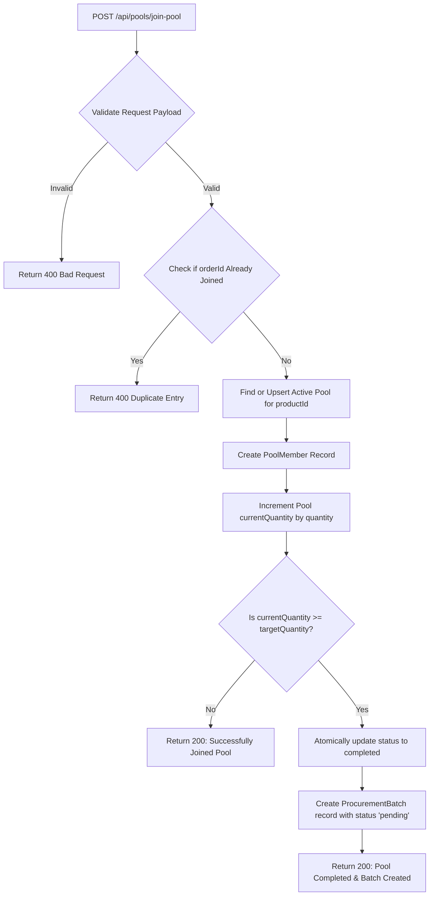

# Zourcefy Procurement Pooling API: System & File Report

This report provides a detailed breakdown of the Zourcefy backend system, its directory structure, database models, API endpoints, request routing flows, and testing suite.

---

## 1. System Architecture Overview

Zourcefy is a Node.js/Express-based backend designed to handle **procurement pooling**. The system allows multiple customers/orders to pool their demand for specific products. Once the aggregate demand (quantity) for a product meets or exceeds a defined target threshold, the pool is closed (completed) and a consolidated **procurement batch** is generated for ordering.

### Core Features
* **Atomic Pooling Logic**: Auto-creates or retrieves active pools during customer join requests, incrementing quantities atomically to prevent race conditions.
* **Dual-Mode Database Layer**: Dynamically proxies all queries between a remote MongoDB Atlas instance (via mongoose) and an in-memory mock database (`mockDb.js`) if MongoDB is unavailable or if `MOCK_DB=true` is set.
* **Idempotent Joins**: Enforces strict unique constraints on Order IDs to prevent duplicate pool entries.
* **Consolidated Batches**: Automatically transitions pools to a completed state and spawns procurement batches immediately upon crossing the threshold.

---

## 2. Directory & File Structure

Below is the complete tree representation of the codebase along with the role of each file:

```text
d:\zourcefy\
├── controllers/
│   ├── poolController.js         # Core pooling handlers (join, create, list, details)
│   └── procurementController.js  # Procurement batch handlers (list, update status)
├── models/
│   ├── Pool.js                   # Mongoose/Mock Pool schema & model proxy
│   ├── PoolMember.js             # Mongoose/Mock PoolMember schema & model proxy
│   ├── ProcurementBatch.js       # Mongoose/Mock ProcurementBatch schema & model proxy
│   └── mockDb.js                 # In-memory mock database implementation
├── routes/
│   ├── poolRoutes.js             # Router mounting all pool endpoints
│   └── procurementRoutes.js      # Router mounting all procurement endpoints
├── tests/
│   └── run-tests.js              # 10-step integration test runner
├── .env                          # Local environment settings (database credentials)
├── .gitignore                    # Version control ignore definitions
├── package.json                  # Node.js project manifest & scripts
├── package-lock.json             # Precise package dependency tree lock
└── server.js                     # Express application configuration and startup script
```

---

## 3. Detailed File Directory & Analysis

| File Path | Primary Responsibility | Key Functions / Details |
| :--- | :--- | :--- |
| `server.js` | Express app bootstrap | Configures middlewares (`cors`, `express.json`, `morgan`), hooks up global error handling, runs connection checks to MongoDB Atlas, and falls back to Mock DB mode if connection fails. |
| `controllers/poolController.js` | Business logic for pools | * `joinPool`: Atomic join operation, target checks, and procurement batch triggering.<br>* `createPool`: Manual pool creation with custom targets.<br>* `getActivePools`: Returns active pooling instances.<br>* `getPoolDetails`: Fetches a pool metadata along with its participant members. |
| `controllers/procurementController.js`| Business logic for batches | * `getProcurementBatches`: Lists batches, supports filtering by status/productId.<br>* `updateBatchStatus`: Updates batch status (`pending`, `ordered`, `completed`) with validations. |
| `models/Pool.js` | Pool schema definition | Defines fields: `productId`, `targetQuantity` (default 100), `currentQuantity`, `status` (`active`/`completed`), `completedAt`. Configures composite index `{ productId: 1, status: 1 }`. |
| `models/PoolMember.js` | Pool member schema definition | Defines fields: `poolId`, `customerId`, `orderId` (unique constraint), `quantity`, `joinedAt`. |
| `models/ProcurementBatch.js` | Procurement batch schema | Defines fields: `poolId`, `productId`, `totalQuantity`, `status` (`pending`/`ordered`/`completed`), `createdAt`. |
| `models/mockDb.js` | In-memory mock engine | Implements `MockQuery` (supporting `.sort()`), `MockPool`, `MockPoolMember`, and `MockProcurementBatch` to replicate mongoose query API operations offline. |
| `routes/poolRoutes.js` | Pool API routing | Maps endpoints: `POST /join-pool`, `POST /`, `GET /active`, and `GET /:id` to their controller actions. |
| `routes/procurementRoutes.js` | Procurement routing | Maps endpoints: `GET /` and `PATCH /:id` to their controller actions. |
| `tests/run-tests.js` | Integration test suite | Spawns a background test server on port 3000, performs 10 consecutive API fetch requests against MongoDB Atlas, asserts JSON payloads, and gracefully shuts down. |

---

## 4. System Workflow Diagram

The flowchart below displays how a join-pool request travels through the controller logic and decides whether to transition a pool and generate a procurement batch:



---

## 5. API Endpoint Specifications

### Pooling Routes (`/api/pools`)
* **`POST /api/pools/join-pool`** (Also accessible at root `POST /join-pool`)
  * **Description**: Joins the active pool for a product, or creates one if none exists.
  * **Payload**: `{ "productId": "steel-101", "customerId": "cust-99", "orderId": "ord-202", "quantity": 30 }`
  * **Success Response (200 OK)**: Returns the updated pool, the member metadata, and whether a new procurement batch was spawned.
* **`POST /api/pools`**
  * **Description**: Manually pre-create an active pool with a specific target.
  * **Payload**: `{ "productId": "copper-202", "targetQuantity": 150 }`
  * **Success Response (201 Created)**: Returns the newly initialized pool.
* **`GET /api/pools/active`**
  * **Description**: Retrieves all pools currently accepting orders.
* **`GET /api/pools/:id`**
  * **Description**: Retrieves detailed info of a pool and a list of all its members.

### Procurement Routes (`/api/procurements`)
* **`GET /api/procurements`**
  * **Description**: Gets all generated procurement batches. Supports query parameters `status` and `productId` for filtering.
* **`PATCH /api/procurements/:id`**
  * **Description**: Updates the status of a procurement batch.
  * **Payload**: `{ "status": "ordered" }` (Valid statuses: `pending`, `ordered`, `completed`)
